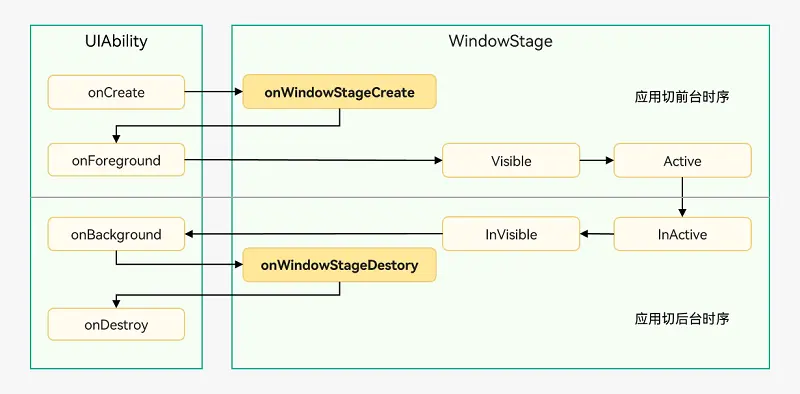

# Harmony学习笔记

### 应用配置文件概述（基于Stage模型开发）
在基于Stage模型开发的应用项目代码下，都存在一个app.json5及一个或多个module.json5这两种配置文件。

#### app.json5主要包含以下内容：
应用的全局配置信息，包含应用的包名、开发厂商、版本号等基本信息。 特定设备类型的配置信息。

#### module.json5主要包含以下内容：
Module的基本配置信息，例如Module名称、类型、描述、支持的设备类型等基本信息。 应用组件信息，包含UIAbility组件和ExtensionAbility组件的描述信息。 应用运行过程中所需的权限信息。